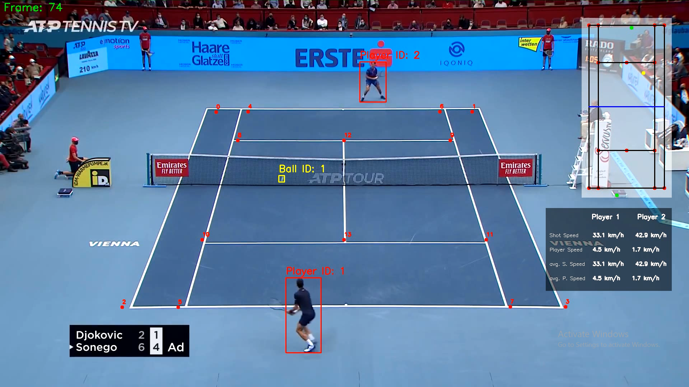

# 🎾 Tennis Analysis System

An advanced Computer Vision & Sports Analytics project for tennis match analysis.  
This system detects and tracks players and tennis balls from match videos, extracts court keypoints, and generates insightful performance statistics such as:
- Player speed (km/h)
- Ball shot velocity
- Rally count
- Court coverage visualization
- Annotated match videos with real-time overlays



## 🚀 Features
- YOLOv8 Object Detection – detect players accurately
- YOLOv5 (fine-tuned) – precise tennis ball detection
- Court Keypoint Extraction – detect court lines & landmarks
- Motion Tracking – estimate player & ball speed
- Rally Counter – analyze gameplay sequences and stats
- Perspective Transformation – map movement to real-world distances

## 🛠 Tech Stack
- Python 3.x
- YOLOv5 / YOLOv8
- OpenCV
- Torch, NumPy, Pandas, Matplotlib
- Roboflow Dataset

## 📂 Project Structure
```
Tennis-Analysis-System/
│── input_videos/        # Input match videos  
│── output_videos/       # Annotated match videos with analysis  
│── models/              # Pretrained YOLO & court models  
│── trackers/            # Player and ball tracking logic  
│── training/            # Training notebooks and datasets  
│── utils/               # Helper and visualization functions  
│── main.py              # Main entry point  
│── README.md  
```

## 📦 Requirements
pip install ultralytics torch opencv-python numpy matplotlib pandas

## 📚 Resources
- 📂 Sample Input Video: [Google Drive Link](https://drive.google.com/file/d/164qcY81eJC9FOs2qb8oijeIUK42OiMVe/view?usp=drive_link)
- 📂 Roboflow Dataset: [Tennis ball Dataset](https://universe.roboflow.com/viren-dhanwani/tennis-ball-detection)
- 📂 Trained YOLOv5 Model: [Google Drive Link](https://drive.google.com/file/d/1R83HsanMRRqzp5seFw6TJSrCktLCbai8/view?usp=drive_link)
- 📂 Trained tennis court key point model: [Google Drive Link](https://drive.google.com/file/d/1WQk5m2vT8rRM4euG9ZBPb8Es9fMYHhX-/view?usp=drive_link)

## 🎯 About the Project
This project integrates state-of-the-art computer vision models with sports analytics for real-world tennis match analysis.
It demonstrates skills in:
- Training and fine-tuning YOLO models
- Extracting performance metrics and visual analytics from video data